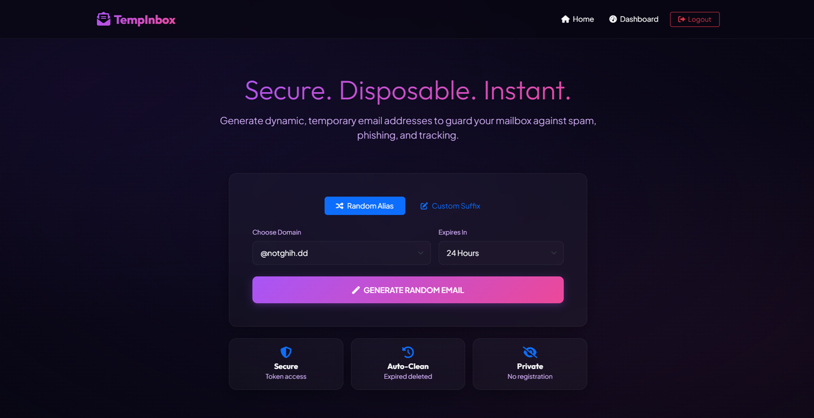

# 📬 TempInbox — Self-Hosted Temporary Email System

[](https://php.net)
[](https://sqlite.org)
[](https://getbootstrap.com)
[](LICENSE)
[](/)



TempInbox is a production-ready, open-source temporary email service written in **PHP 8.3+** and **SQLite**. It connects to a catch-all IMAP mailbox, pulls emails in real-time, and serves them through a premium dark-mode Bootstrap 5 dashboard. Supports outbound email sending, threaded replies, browser notifications, and a full admin panel.

> **Zero external dependencies.** No Composer required. Works on standard **cPanel shared hosting** out of the box.

---

## ✨ Features

- 📥 **Temporary Alias Generation** — Create random or custom-prefix aliases (e.g. `newsletter.work@yourdomain.com`)
- 📨 **Outbound Send & Reply** — Send new emails and compose threaded replies from any alias
- 🔔 **Browser Notifications & Audio Chime** — Desktop push alerts and Web Audio API chime on new mail arrival
- 🔒 **Sandboxed HTML Rendering** — Email bodies rendered inside a CSP-locked `<iframe>` to prevent XSS
- 🗄️ **SQLite Zero-Config Setup** — Database auto-creates on first launch with no MySQL setup needed
- 🛡️ **Security First** — CSRF tokens, IP-based rate limiting, SQL injection prevention via PDO prepared statements
- 🤖 **Unified Cron Automation** — Single `cron.php` handles IMAP fetching every minute + hourly cleanup automatically
- ⚙️ **Admin Dashboard** — System stats, alias management, SMTP/IMAP configuration UI, and live system logs

---

## 🖥️ System Requirements

| Requirement | Minimum |
|---|---|
| PHP | **8.1 or higher** |
| PHP Extensions | `imap`, `pdo_sqlite`, `openssl`, `mbstring` |
| Web Server | Apache (with `mod_rewrite`) or Nginx |
| Hosting | cPanel shared hosting, VPS, or local XAMPP/LAMP |
| Mail Server | A domain configured with a catch-all/wildcard forwarder |

---

## 📁 Project Structure

```
TempInbox/
├── app/
│   ├── controllers/        # MVC Controllers (BaseController, HomeController, InboxController, AliasController, AdminController)
│   ├── models/             # Data models (Alias, Message, Setting, Log)
│   ├── services/           # Core services (Database, ImapService, SmtpService, MailParser, RateLimiter)
│   └── views/              # HTML/PHP templates and layout partials
│       ├── layouts/
│       │   └── main.php    # Main HTML layout (Bootstrap 5 shell)
│       ├── home/
│       ├── inbox/
│       └── admin/
├── config/
│   ├── config.php          # ⚠️  Main configuration file — edit this before first launch
│   └── schema.sql          # SQLite schema (auto-executed on first run)
├── cron/
│   ├── cron.php            # ✅ Unified cron runner — use this (fetch + cleanup)
│   ├── fetch.php           # IMAP-only fetch script (optional/legacy)
│   └── cleanup.php         # Database cleanup script (optional/legacy)
├── public/                 # ← Point your web server / domain root here
│   ├── assets/             # CSS, JS, Bootstrap 5 files
│   ├── index.php           # Front controller & URL router
│   └── .htaccess           # Apache URL rewrite rules
├── storage/                # SQLite database file (auto-created at runtime)
├── tests/
│   ├── test_imap.php       # IMAP connection & database diagnostic tool
│   └── test_smtp.php       # SMTP connection diagnostic tool
├── INSTALL.md
├── CRON_SETUP.md
└── README.md
```

---

## 🚀 Installation Guide

### Step 1 — Configure a Catch-All Mailbox

TempInbox needs one dedicated inbox that receives **all** emails sent to your domain.

**On cPanel:**
1. Log in to your **cPanel** dashboard
2. Navigate to **Email → Default Address**
3. Select your domain (e.g. `yourdomain.com`)
4. Choose **"Forward to Email Address"**
5. Enter your catch-all address: `catchall@yourdomain.com`
6. Click **Change**

> Any email sent to `anything@yourdomain.com` will now arrive at `catchall@yourdomain.com`, which TempInbox polls via IMAP.

---

### Step 2 — Create the Email Account

1. cPanel → **Email Accounts → Create**
2. Create: `catchall@yourdomain.com` (or any name you prefer)
3. Set a strong password and **save it** — you will need it for the config file

---

### Step 3 — Upload Files to Server

**Option A — Subfolder (simplest):**
Upload the entire `TempInbox/` folder inside `public_html/`:
```
/home/username/public_html/TempInbox/
```
Access the site at: `https://yourdomain.com/TempInbox/public/`

**Option B — Root domain (recommended for production):**
1. Upload everything *except* `public/` to a folder **outside** the web root (e.g. `/home/username/tempinbox_core/`)
2. Upload only the contents of `public/` to `public_html/`

> The bundled `.htaccess` files automatically block direct browser access to `/app`, `/config`, `/storage`, and `/cron` directories.

---

### Step 4 — Edit the Configuration File

Open `config/config.php` and fill in your server details:

```php
'app' => [
    'url'              => 'https://yourdomain.com/TempInbox/public', // No trailing slash
    'allowed_domains'  => ['yourdomain.com'],                        // Your mail domain(s)
    'timezone'         => 'UTC',                                      // e.g. 'Asia/Dhaka', 'America/New_York'
],

'imap' => [
    'host'          => 'mail.yourdomain.com',       // IMAP server hostname
    'port'          => 993,                          // 993 = SSL, 143 = TLS
    'encryption'    => 'ssl',                        // 'ssl' or 'tls'
    'validate_cert' => false,                        // Set to true if you have a valid SSL cert
    'username'      => 'catchall@yourdomain.com',   // Your catch-all email address
    'password'      => 'YOUR-EMAIL-PASSWORD',
    'folder'        => 'INBOX',
    'fetch_limit'   => 50,
],

'smtp' => [
    'host'       => 'mail.yourdomain.com',           // ← hostname only, NOT an email address
    'port'       => 587,                              // 587 = TLS/STARTTLS, 465 = SSL
    'encryption' => 'tls',                           // 'tls' or 'ssl'
    'username'   => 'catchall@yourdomain.com',        // Full email address
    'password'   => 'YOUR-EMAIL-PASSWORD',
],
```

> ⚠️ **Common mistake:** The `smtp.host` field must be the **mail server hostname** (e.g. `mail.yourdomain.com`), not an email address.

---

### Step 5 — First Launch

Visit your site URL in a browser:
```
https://yourdomain.com/TempInbox/public/
```

On the very first request, TempInbox will automatically:
- Create the SQLite database at `/storage/database.sqlite`
- Execute the schema and build all tables
- Insert default settings and the admin account

**No manual database setup required.**

---

### Step 6 — Admin Panel

1. Navigate to: `https://yourdomain.com/TempInbox/public/admin`
2. Log in with the default credentials:

   | Field | Default Value |
   |---|---|
   | Username | `admin` |
   | Password | `AdminTempInbox2026!` |

3. ⚠️ **Immediately** open the **Settings** tab and:
   - Change the admin username and password
   - Verify your allowed mail domain(s)
   - Fill in your SMTP credentials for outbound email sending

---

### Step 7 — Set Up the Cron Job (cPanel)

The cron job polls your IMAP inbox every minute to fetch new emails.

1. cPanel → **Advanced → Cron Jobs**
2. Set the following:
    - **Schedule:** `* * * * *` (Every Minute)
    - **Command:**
      ```bash
      /usr/local/bin/ea-php81 /home/username/public_html/TempInbox/cron/cron.php >/dev/null 2>&1
      ```
3. Click **Add New Cron Job**

> Replace `/home/username/` with the real path to your cPanel home directory.

**Common PHP binary paths:**

| Server Type | Binary Path |
|---|---|
| EasyApache 4 (standard cPanel) | `/usr/local/bin/ea-php81` |
| CloudLinux Alt-PHP | `/opt/alt/php81/usr/bin/php` |
| Generic Linux / VPS | `/usr/bin/php` or `/usr/local/bin/php` |

> If unsure, check **cPanel → MultiPHP Manager** or ask your hosting provider.

---

## 📧 SMTP Settings Reference

Configure these in **Admin Panel → Settings → Outbound SMTP** (or directly in `config.php`):

| Field | What to Enter | Example |
|---|---|---|
| **SMTP Host** | Mail server hostname only | `mail.yourdomain.com` |
| **SMTP Port** | `587` for TLS · `465` for SSL | `587` |
| **Encryption** | Match your port | `TLS (STARTTLS)` |
| **SMTP Username** | Full email address | `noreply@yourdomain.com` |
| **SMTP Password** | Password of that email account | *(set in cPanel → Email Accounts)* |

> **Tip:** If SMTP fields are left blank, the system automatically falls back to the IMAP account credentials for outgoing mail.

---

## 🌐 DNS Records for Email Deliverability

Without these records, outbound emails will likely be marked as spam by Gmail, Outlook, etc.

**How to add:** cPanel → **Zone Editor** → **Manage** → **Add TXT Record**

### SPF Record
```
Name:   yourdomain.com.
TTL:    14400
Type:   TXT
Value:  v=spf1 a mx include:yourdomain.com ~all
```

### DKIM Record
1. cPanel → **Email → Email Deliverability** (or search "DKIM" in cPanel search bar)
2. Click **Repair** or **Install** next to your domain
3. cPanel generates and installs the DKIM key automatically

> If "Email Deliverability" is not available, contact your hosting provider support and request DKIM be enabled for your domain.

### DMARC Record
```
Name:   _dmarc.yourdomain.com.
TTL:    14400
Type:   TXT
Value:  v=DMARC1; p=none; rua=mailto:admin@yourdomain.com
```

> ⚠️ **"Mismatched TTL" warning?** It means a duplicate record already exists. Delete the old one from Zone Editor and keep only one entry with a consistent TTL value.

---

## 🔒 Post-Installation Security Checklist

- [ ] Change the default admin password on first login
- [ ] Set `validate_cert => true` in IMAP config once SSL is valid
- [ ] Configure SPF, DKIM, and DMARC DNS records
- [ ] Confirm `.htaccess` blocks direct browser access to `/app`, `/config`, `/storage`, `/cron`
- [ ] Rate limiting is enabled (`security.rate_limit.enabled => true` in `config.php`)

---

## 🧪 Diagnostics

Run these commands via SSH to verify your setup before going live:

```bash
# Test IMAP connection and database integrity
/usr/local/bin/ea-php81 /home/username/public_html/TempInbox/tests/test_imap.php

# Test SMTP connection and authentication
/usr/local/bin/ea-php81 /home/username/public_html/TempInbox/tests/test_smtp.php
```

**Successful output looks like:**
```
[SUCCESS] SQLite Connection established.
[INFO]    Active tables: aliases, messages, settings, logs, rate_limits
[SUCCESS] IMAP Connection successful. Found 12 messages.
```

---

## ❓ Troubleshooting

| Problem | Likely Cause | Fix |
|---|---|---|
| CSS/JS not loading (broken layout) | Wrong `app.url` in `config.php` | Set the correct live URL, no trailing slash |
| `getaddrinfo failed` SMTP error | Email address used as SMTP Host | Use server hostname: `mail.yourdomain.com` |
| Emails sent to spam | Missing SPF / DKIM / DMARC | Set up all three DNS records (see above) |
| Cron job not fetching emails | Wrong PHP binary path in cron command | Check **cPanel → MultiPHP Manager** for the right path |
| `mismatched TTL` DNS error | Duplicate TXT record with different TTL | Delete the duplicate; keep one entry with matching TTL |
| Admin panel assets broken | Hardcoded localhost URL | Confirm `app.url` in `config.php` reflects your live domain |
| 404 error on all routes | `mod_rewrite` not active | Enable `AllowOverride All` in Apache, or use `?route=path` fallback |
| Cannot log in to admin | Default credentials changed / DB missing | Run `tests/test_imap.php` to verify the database is intact |

---

## 🏗️ Architecture Overview

```
 External Email Sender
         │
         ▼
 alias@yourdomain.com
         │  (catch-all forwarder via mail server)
         ▼
 catchall@yourdomain.com
         │
         ▼
 cron/cron.php  ──── (runs every 1 minute via cPanel Cron Jobs)
         │  IMAP poll → parse → store matched messages
         ▼
 SQLite Database  (storage/database.sqlite)
         │
         ▼
 TempInbox MVC Web App  (public/index.php)
         │
         ▼
 User Browser  →  Inbox view / Compose / Reply
```

---

## 🤝 Contributing

Contributions, bug reports, and feature suggestions are welcome! Please open an issue or submit a pull request.

1. Fork the repository
2. Create a feature branch: `git checkout -b feature/your-feature-name`
3. Commit your changes: `git commit -m 'Add some feature'`
4. Push to the branch: `git push origin feature/your-feature-name`
5. Open a Pull Request

---

## 📄 License

This project is open-source and released under the **[MIT License](LICENSE)**.
Free to use, modify, and distribute for personal or commercial purposes.

---

<p align="center">
  Built with ❤️ using PHP 8.3 · SQLite · Bootstrap 5 · Zero Composer Dependencies
</p>
